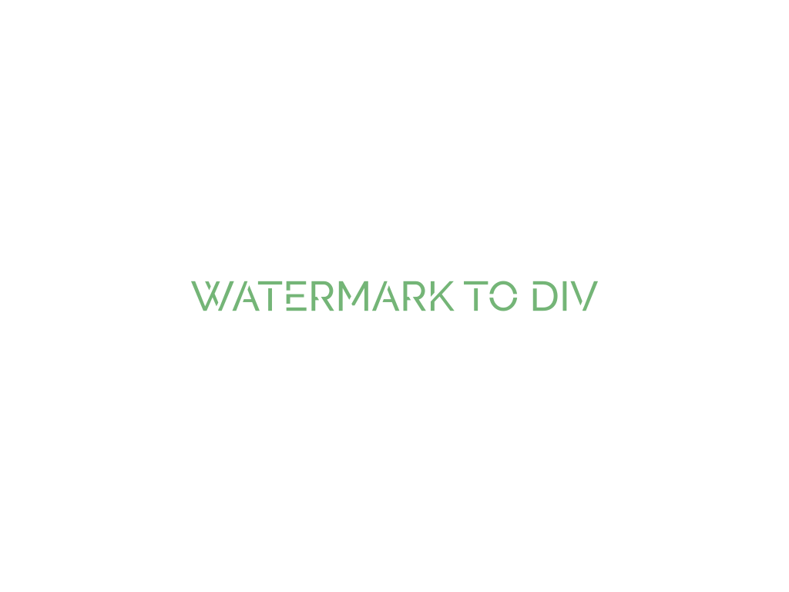

<p align="center">
  
</p>

## demo

[https://liugq5713.github.io/watermarkToDiv/](https://liugq5713.github.io/watermarkToDiv/)

## Features

1.  Using a text to stamp
2.  you can rotate the stamp in any rotate
3.  add watermark to any html elements,so you can add different watermarks in a web page

### Defact

1.  watermark will set the position of the element for relative which contain the watermark
2.  when you set abnormal options of the wartemark like `font:'226px serif'`,`rotate:13/24*Math.PI`.the watermark will only show a part of it and you could fix the issue by set yOffset which control the start point of the text.

## Download

Git

```js
git@github.com:Liugq5713/watermarkToDiv.git
```

npm

```js
npm install --dev-save watermark-div
```

## How to use

### Usage

```js
import Watermark from 'watermark-div'

const OPTIONS = { text: 'Hello World' }
const watermark = new Watermark(OPTIONS)
// contain_el is the container which you want to add watermark
watermark.embed(contain_el)
```

### Options

| Name    | Type   | Default                 | Description                                     |
| ------- | ------ | ----------------------- | ----------------------------------------------- |
| text    | String | 'Hello world'           | the text as watermark                           |
| font    | String | '16px serif'            | Font size and the style of text                 |
| opacity | Number | 0.6                     | the opactity of watermark                       |
| density | number | 1                       | the density of watermark                        |
| rotate  | rad    | -1 / 6 \* Math.PI       | the rotate of watermark                         |
| z_index | number | 2018                    | the element's z-index which has watermark       |
| color   | String | 'rgba(151,168,190,0.6)' | Text color, you can use HEX or RGBA color codes |
| yOffset | number | 3                       | control the start point of text                 |
